# Ambulance-App
request Ambulance in emergency!

## Screenshots of the App
 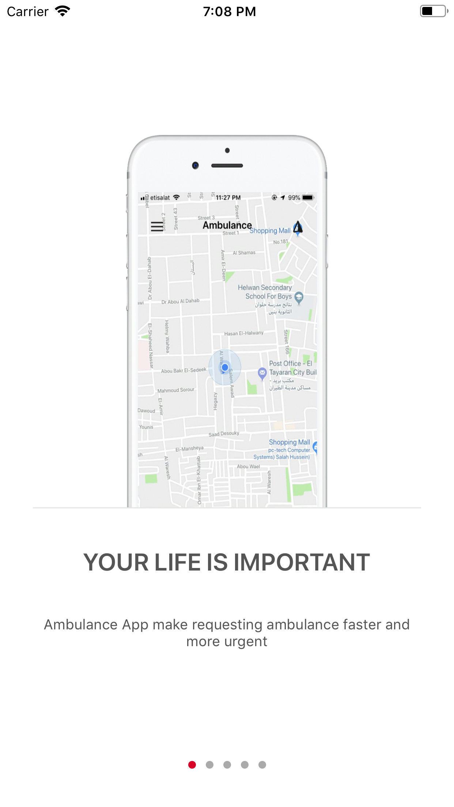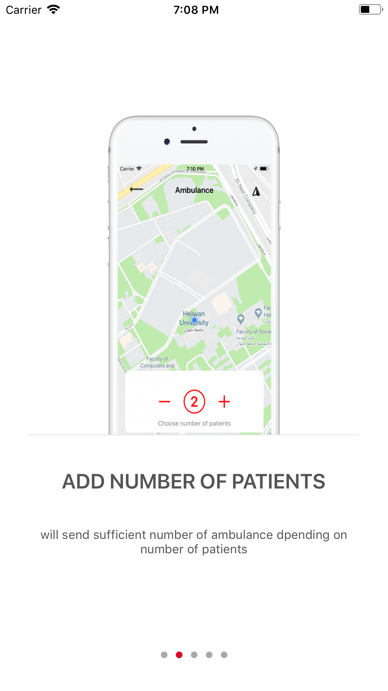 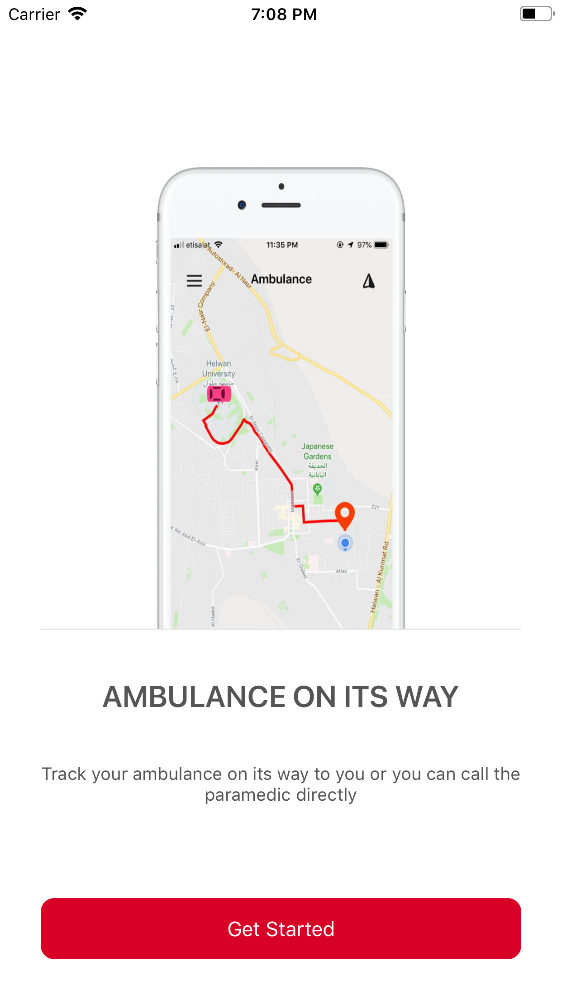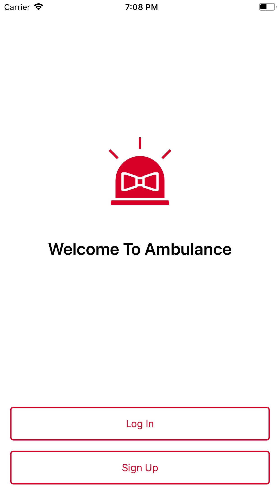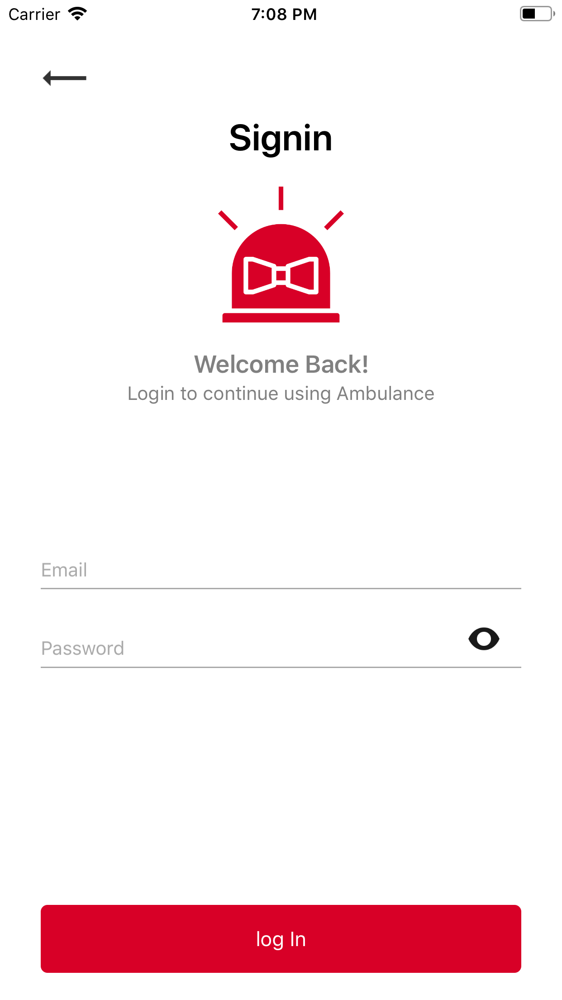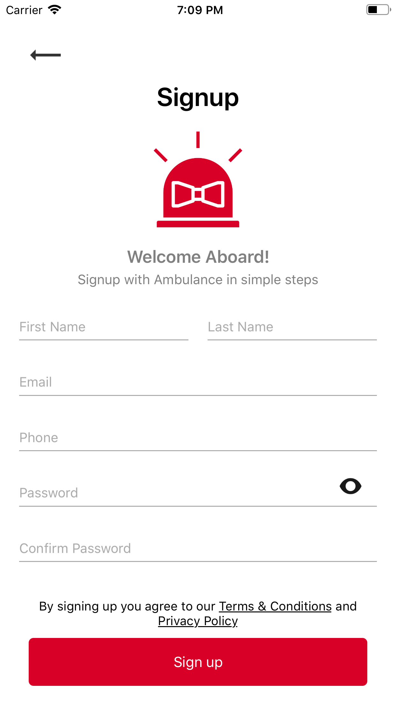 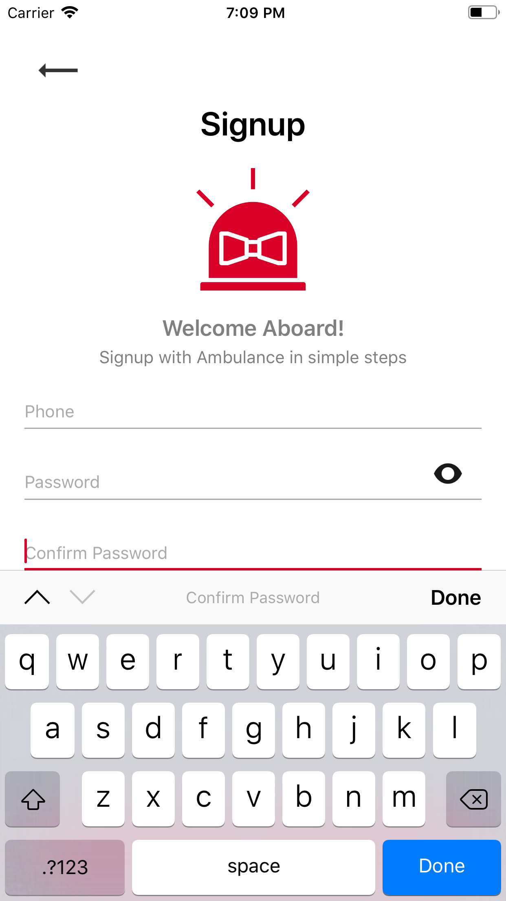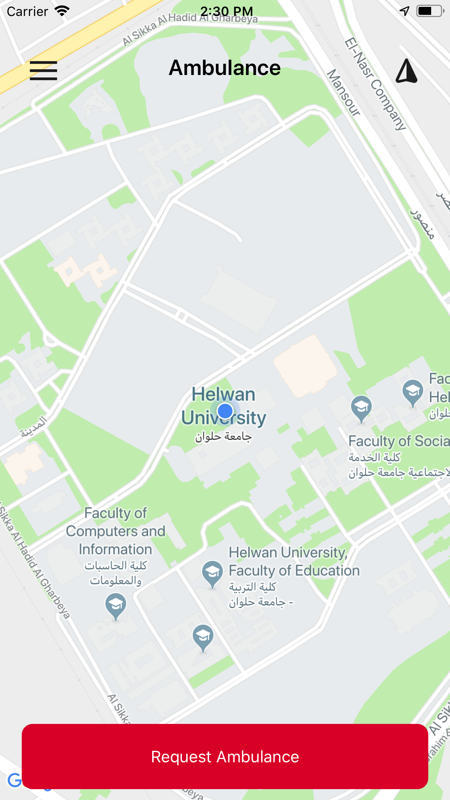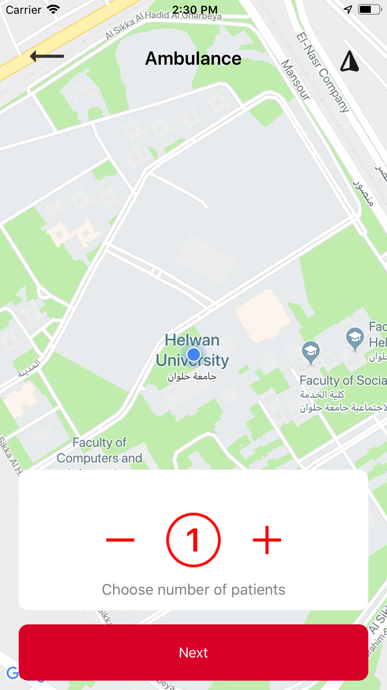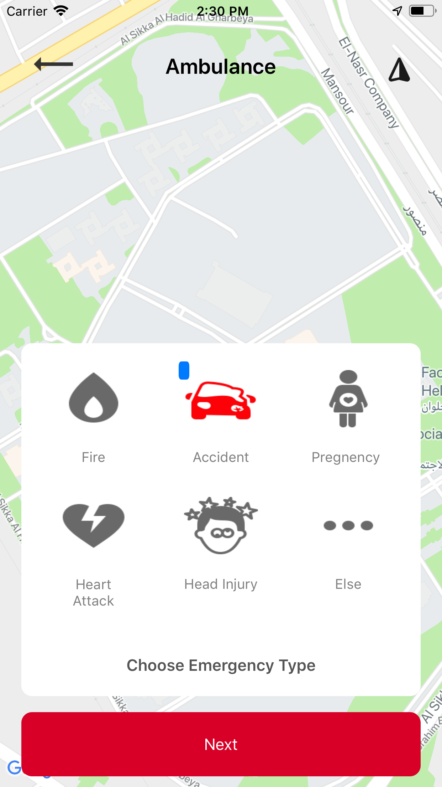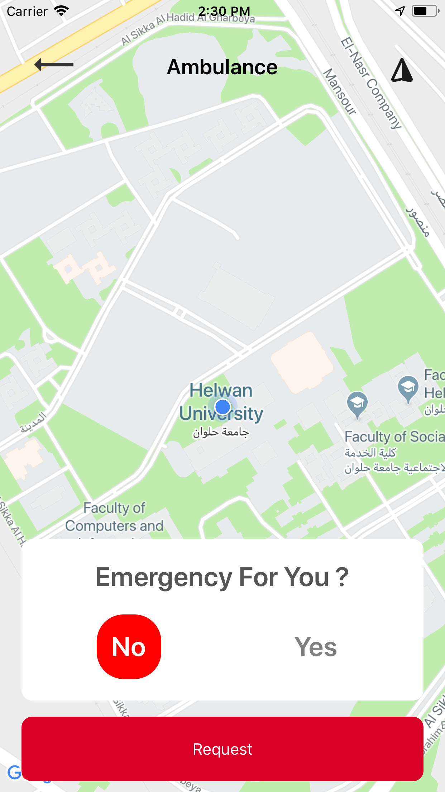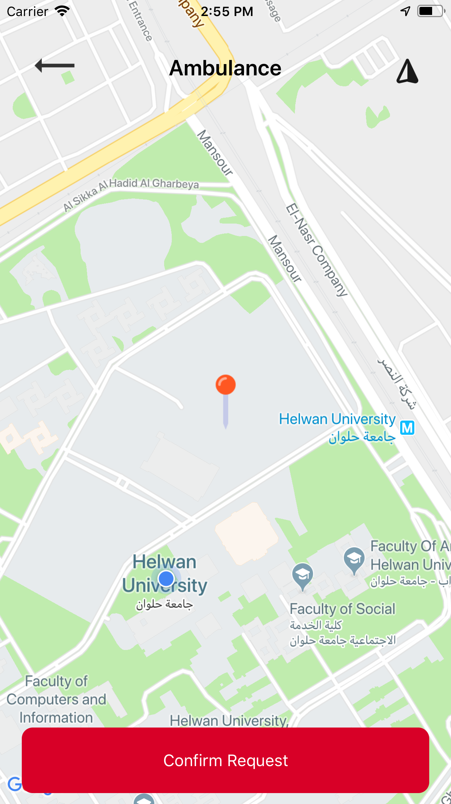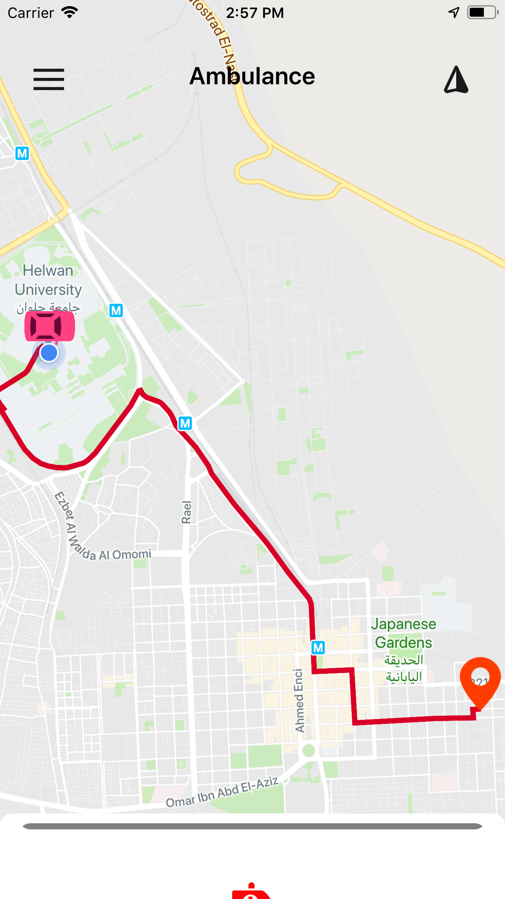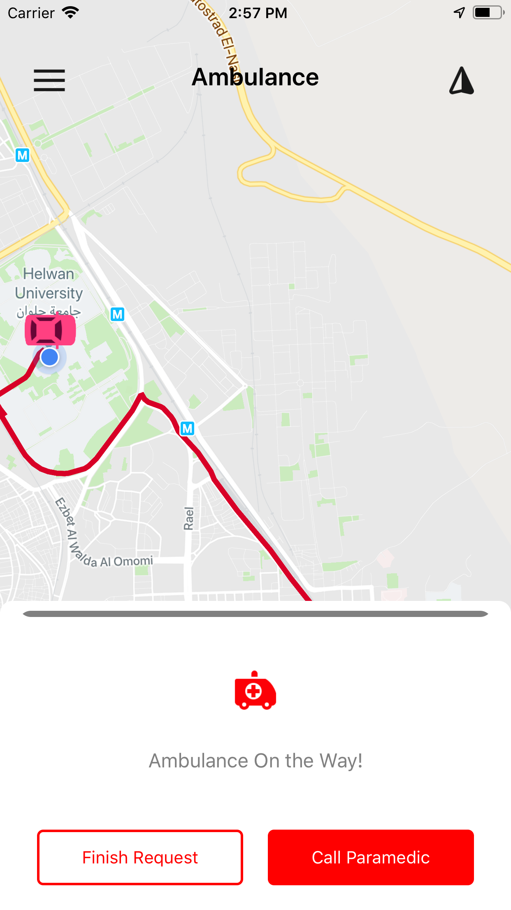

## Specifications
- onboarding screens
- firebase realtime database
- firebase offline storage
- google maps & google maps directions api with core location
- left side menu

## Requirements to run the app on your iPhone
```
iOS 11.0 or higher
```
Xcode 10
```
